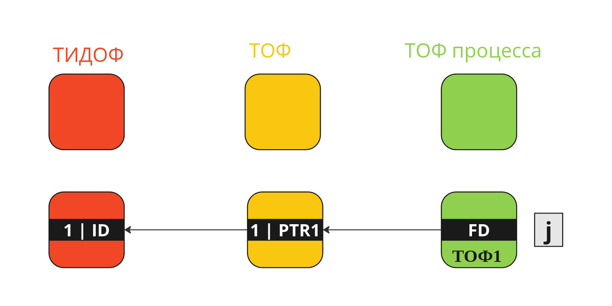
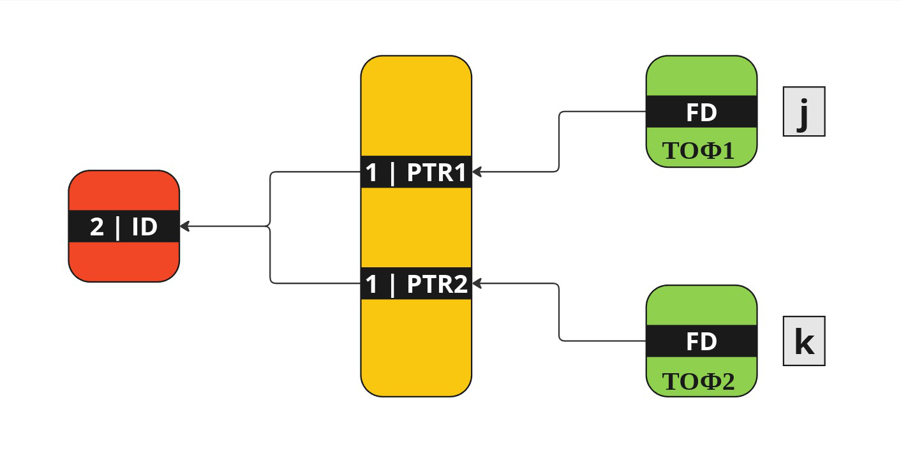
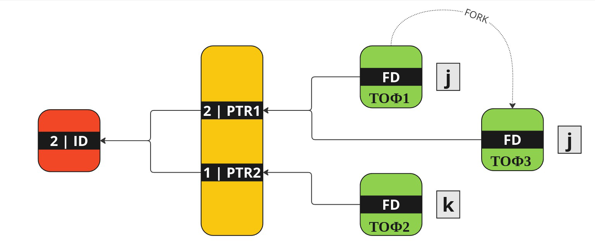

Этот большой раздел будет посвящён основным функциям языка С, необходимым для работы в _однопроцессорных_ программах. Здесь будут собраны материалы по работе со строками, с файлами и директориями, работе со временем. Немножко теории ОСей, объясняющей происходящее; немножко теории С, а также задачки, на примерах которых мы будем разбирать работу функций. 

Аргументы командной строки
---

Аргументы командной строки подаются при вызове программы из командной строки

```console
./a.out <аргумент1> <аргумент2> <аргумент3> ...
```

Для работы с ними внутри нашей программы используются два параметра функции `main`, которые принято называть _**argc**_ и _**argv**_
_**argc**_ - параметр, который хранит количество поступающих в функцию аргументов
_**argv**_ - массив строковых аргументов (все аргументы командной строки приходят в виде последовательностей символов, это сохранившаяся с момента изобретения [терминала](https://github.com/UsamG1t/Methodics_of_LinuxAppDev/blob/master/Methodical_manual/01_TerminalProject/1.%20Работа%20с%20терминалом%3B%20пример%20простого%20проекта.md) особенность).

Первый аргумент (`argv[0]`) существует всегда, это само название исполняемой программы; соответственно, `argc` всегда >= 1. Память под множество аргументов командной строки выделяется в специальном месте, в конце оканчиваясь нулевым указателем (`argv[argc] = NULL`). То есть даже не зная, какое количество аргументов приняля наша программа, мы всё равно сможем корректно каждый элемент обработать:

`argv.c`
```c
#include <stdio.h>
#include <string.h>

int main(int argc, char** argv) {
    for(int i = 1; i < argc; i++) {
        printf("%s\n", argv[i]);
    }
}
```

```console
stephen@localhost:path/to/somewhere> gcc argv.c -o argv
stephen@localhost:path/to/somewhere> ./argv
stephen@localhost:path/to/somewhere> ./argv qwerty Hello 123 100500 z1x2c3v4
qwerty
Hello
123
100500
z1x2c3v4
stephen@localhost:path/to/somewhere>
```

Но зачем нам тогда и количественный счётчик, и в памяти ограничитель? А что если за ограничитель посмотреть?

```c
#include <stdio.h>
#include <string.h>

int main(int argc, char** argv) {
	int i = argc + 1;
	while (argv[i] != NULL) {
		printf("%s\n", argv[i++]);
	}
}
```

```console
stephen@localhost:path/to/somewhere> gcc arge.c -o arge
stephen@localhost:path/to/somewhere> ./arge # ждём полный крах программы
SHELL=/bin/bash # А его нет
<...>
HOSTNAME=localhost.localdomain
<...>
CPU=x86_64
<...>
PWD=/home/stephen/jaffar_torrent/Conspectology/00.C_Anthology/Attached_materials
<...>
HOME=/home/stephen
<...>
HOST=localhost.localdomain
<...>
_=./arge
stephen@localhost:path/to/somewhere> 
```

Да, как уже можно было догадаться, в памяти ровно за массивом аргументов командной строки идёт массив аргументов переменных окружения _**arge**_

Переменные окружения это уже небольшая отсылка на многопроцессорную работу нашего компьютера: мы не передавали эти данные в программу, но вызвавший её процесс (тот, который отвечает за терминал, из которого мы вызвали программу) пробросил их в наш процесс при вызове.

Обработка переполнений
---

Выделяю этот блок отдельно, чтобы познакомить вас с прекрасным миром встроенных в С функций.

Вообще любая обработка любых ошибок должна куда-то описываться. Во время работы программы в процессе, её содержащем автоматически (если механически не сделано иное) открываются три потока для обработки данных: `stdin` - поток ввода, `stdout` - поток вывода и `stderr` - поток ошибок (тоже выходной поток, просто предназначенный именно для логирования {описания} некорректной работы программы). Для написания в `stderr` можно воспользоваться специальными функциями вывода, которые пишут направлено в него, или самому перенаправить вывод:

```c
perror("Error = ");
fprintf(stderr, "%s%s\n", "Error = ", stderror(errno));
```

 Теперь касательно переполнений. Для них есть аж **три** очень культурных и принятых кодстайлами способа проверки
  + Если разрешено пользоваться расширениями `gcc`,  можно воспользоваться специальными [встроенными функциями по обработке переполнения](https://gcc.gnu.org/onlinedocs/gcc/Integer-Overflow-Builtins.html) 
    Общий формат функции: `bool __builtin_<sign><operation><type>_overflow(type1 v1, type2, v2, type3* res)`
    Здесь `sign` отвечает за знаковость типа (`''` или`'s'` - знаковый, `'u'` - беззнаковый), `operation` за проверочную операцию (`'add'`, `'sub'`, `'mul'`), `type` за типы операндов в операции(`''` для типов <= `int`, `'l'` для `long`, `'ll'` для `long long`)
    Например, функция проверки переполнения при умножении беззнаковых `long` величин будет выглядеть `__builtin_umull_overflow`
    
    Функция получает два параметра по значению, проводит над ними операцию, результат которой записывает в третий параметр, переданный по указателю, и возвращает `true`, если переполнение было 
 
 + Если расширения нам недоступны, но мы можем пользоваться библиотекой `limits.h`, где указаны все определения характеристик общих типов переменных, можем писать проверки аналогично этой:
   ```c
	int a, b, c;
	c = a + b;
	
	if (a > 0) {
		if (b > INT_MAX - a){
			// overflow
		}
	} else if (a < 0) {
		if (b < INT_MIN - a){
			// overflow
		}
	}
	```

 + Если библиотека нам также недоступна, делаем граничные значения своими ручками:
   ```c
	max 01...1 			max = ~0u >> 1
	min 10...0 			min = ~(~0u >> 1)
	```


Работа со строками
---

Самый популярный тип данных в С, так как через них можно описать любой объект, просто разбив его на последовательность байт и запомнив их в таком формате.

Рассмотрим набор полезных нетривиальных функций, которыми вы сможете пользоваться. Набор некоторых функций для работы со строками вот [здесь](https://www.opennet.ru/man.shtml?topic=string.h&category=3&russian=5) и не только.

 + `strtol / strtoll / strtod`  - получает строковый параметр, преобразовыввает его в число типа `long / long long / double` соответственно.
   
   Обрабатывает строку с начала до появления первого нецифрового символа
   Параметры: 
    1. Строка-источник; 
    2. Указатель, бегущий по строке до первого нецифрового символа; 
    3. Система счисления числа (обрабатывает от СС 2 до 36 (10 цифр + 26 символов английского алфавита, которые могут встречаться для обозначения "цифр" от `10` до `35` включительно); 0 - распознавание по умолчанию, поддерживает распознавание 10-СС, 2-СС для `0b`-чисел, 8-СС для `0`-чисел и 16-СС для `0x`-чисел)
   
   _**TODO**_: проверить, что ещё можно поймать по умолчанию, какие ещё CC
   
   Так как функции написаны для перевода строкового параметра в ограниченный набор типов, а мы далеко не всегда хотим работать именно с указанными, а ещё далеко не всегда обработка проводится корректно (например, параметр `123asdf48` вполне обработается и ошибки не выдаст, но считает только первые три цифры (если мы не указали СС, которая сможет это считать), при этом указатель застынет на символе `'a'`), нужно уметь правильно обрабатывать ошибочные ситуации работы с этой функцией. 
   Рассмотрим пример обработки ошибок при считывании значения типа `int` с помощью `strtol`:
```c
char *eptr = NULL;
errno = 0;
long lval = strtol(str, &eptr, 10);
if (errno || *eptr || eptr == str || (int) lval != lval) {
	// ошибка преобразования
}
``` 

Разберём, что здесь происходит:

	`errno`: Это встроенная в библиотеку ошибок `errno.h` переменная, которая при ошибке выполнения какой-либо функции принимает значение кода её ошибки. Следовательно, если эта переменная ненулевая, что-то при получении числа пошло не так
	`*eptr`: Этот указатель считывает символы со строки, чтобы потом их преобразовать в цифры/числа и собирать итоговое число. Правильный ввод должен считать всю строку и остановиться на нулевом байте после неё. Соответственно, разыменование этого указателя должно давать нам ноль при корректной работе. Если же он остановился где-то в середине строки (следовательно, разыменовался на чём-то кроме нулевого байта), это ошибка
	`eptr == str`: Указатель может вообще никуда не дёрнуться, если нам не задали аргумент. Надо проверить, что он вообще что-то читал (т.е. сдвигался от изначальной позиции)
	`(int) lval != lval`: Это выражение проверяет, что считанное число соответствует типу, который мы изначально планировали получить.

Пример задачи с использованием `strtol`: **посчитать сумму int-чисел в коммандной строке, заданных в 23-СС**
`strtol.c`
```c
#include <stdio.h>
#include <stdlib.h>
#include <unistd.h>
#include <errno.h>

int main(int argc, char** argv) {
	long lval;
	int sum = 0;
	char *eptr;

	for (int i = 1; i < argc; i++) {
		eptr = NULL;
		errno = 0;

		lval = strtol(argv[i], &eptr, 23);
		if (errno || *eptr || eptr == argv[i] || (int) lval != lval) {
			_exit(1);
		}

		sum += lval;
	}

	printf("%d\n", sum);

	return 0;
}
```

```console
stephen@localhost:path/to/somewhere> gcc strtol.c -o strtol
stephen@localhost:path/to/somewhere> ./strtol 
0
stephen@localhost:path/to/somewhere> ./strtol 123 abc ll
6637
stephen@localhost:path/to/somewhere> 
```

---

 + `snprintf` - форматная запись `printf` в строковую переменную заданного размера
   `len = snprintf(char* str, size_t size, const char* format, <...>);`

1. `str[len] = '\0'`
2. Возвращает количество символов без нулевого байта

 + `sscanf` - форматное чтение `scanf` из заданной строки. 

Пример: **Подаётся текст (набор строк) до 255 символов в строке. Каждая строка содержит вещественные числа, необходимо посчитать сумму по каждой строке, вывести всё одной строкой**
`str_inout.c`
```c
#include <stdio.h>
#include <stdlib.h>
#include <string.h>

enum
{
    MAX_LEN = 256
};

int
main(void)
{
    char string[MAX_LEN];
    char result[MAX_LEN];
    int i = 1;

    while(fgets(string, MAX_LEN, stdin)) {
        char* str = string;
        double a, sum = 0;
        int offset;

        while(sscanf(str, "%lf%n", &a, &offset) == 1) { // %n - считает количество байт от начального указателя после чтения числа
            sum += a;
            str += offset;
        }
        snprintf(result, MAX_LEN, "Sum of numbers in the %d-%s string is %lf\n", i, 
            (i == 1) ? "st" : ((i == 2) ? "nd" : ((i == 3) ? "rd" : "th")), sum);
        printf("%s", result);

        i++;
    }


    return 0;
}

```

```console
stephen@localhost:path/to/somewhere> gcc str_inout.c -o str_inout
stephen@localhost:path/to/somewhere> ./str_inout 
1.2 3.4 5.6
Sum of numbers in the 1-st string is 10.200000
7.8 9.0 5
Sum of numbers in the 2-nd string is 21.800000
stephen@localhost:path/to/somewhere>
```

---

 + `memmove` - переносит данные указанного размера от одного указателя на место, указанное другим
   
   Параметры:
   1. Указатель места приёма даных
   2. Указатель начала источника данных
   3. Размер данных

Не играет роли, что за данные, с начала ли считаются; суть лишь в переносе определённого количества байт данных из одного места в другое

Пример: **Удалить символ строки под номером pos**
```c
char*
delete_symbol(char* string, int pos)
{
char* p_string = string;

p_string = memmove(p_string + pos, p_string + pos + 1, strlen(string) - pos);

return string;
}
```


Работа с файлами
---

Для работы с обычными текстовыми файлами мы используем специальный тип `FILE*`, для открытия-закрытия файла пару `fopen-fclose` и функции работы с фаловыми строками для чтения и записи данных.

Пример: **Вводится имя файла. Посчитать количество каждой буквы в файле, другие символы игнорировать**
`file.c`
```c
#include <stdio.h>
#include <stdlib.h>
#include <ctype.h>
#include <limits.h>
#include <string.h>

enum
{
    NUM = 26
};

int main(void) {
    char name[PATH_MAX];
    fgets(name, PATH_MAX, stdin); // Да, stdin это тоже как будто FILE*

    if (strlen(name) > 0 && name[strlen(name) - 1] == '\n') {
        name[strlen(name) - 1] = '\0';
    }
    
    FILE* f1 = fopen(name, "r"); // Открыли файл на чтение

    if (f1 == NULL) {
        return 1;
    }

    unsigned long count[NUM] = {};
    int a;

    int i = 0;
    while ((a = fgetc(f1)) != EOF) { // достаём по символу из файла
        if(isalpha(a)) {
            count[tolower(a) - 'a']++;
        }
    }

    for (int i = 0; i < NUM; i++) {
        printf("\'%c\' - %lu\n", 'a' + i, count[i]);
    }

    return 0;
}

```

```console
stephen@localhost:path/to/somewhere> gcc file.c -o file
stephen@localhost:path/to/somewhere> ls
arge    argv    file    str_inout    strtol
arge.c  argv.c  file.c  str_inout.c  strtol.c
stephen@localhost:path/to/somewhere> ls > file.txt
stephen@localhost:path/to/somewhere> ./file 
file.txt
'a' - 4
'b' - 0
'c' - 5
'd' - 0
'e' - 5
'f' - 3
'g' - 4
'h' - 0
'i' - 5
'j' - 0
'k' - 0
'l' - 5
'm' - 0
'n' - 2
'o' - 4
'p' - 0
'q' - 0
'r' - 8
's' - 4
't' - 10
'u' - 2
'v' - 2
'w' - 0
'x' - 1
'y' - 0
'z' - 0
stephen@localhost:path/to/somewhere>
```

Однако наша работа будет проводиться преимущественно (почти наверное всегда) с бинарными файлами. Нас больше не будут интересовать символы, которые описываются байтами данных, нас будут интересовать сами байты. 
Работу с файлами мы будем организовывать через системные вызовы (СВ). _**СВ**_ это некий интерфейс между пользовательскими программами и ОС, осуществляющий низкоуровневую (системную) обработку запроса.

Основные библиотеки для работы с файлами
```c
#include <fcntl.h>
#include <unistd.h>
#include <sys/types.h>
#include <sys/file.h>
``` 

#### Немножко теории файловых систем: 

Между файловой системой и нами - пользователем - лежат 3 таблицы, контролирующие обращения в ФС (Первые две хранятся в ядре ОС, третья - в контексте процесса)

Первая - _Таблица Индексных Дескрипторов Открытых Файлов_ (ТИДОФ)
В ней хранятся номера индексных дескрипторов файлов, к которым был применём системный вызов `open`. Также в служебном поле строчки с ИД записано количество ссылок на этот файл (при первом обращении запись в ТИДОФ с этим ИД создаётся, дальше - просто изменяется значение количества ссылок)

Вторая - _Таблица Открытых Файлов_ (ТОФ)
От ТИДОФ она получает номер записи, где в ТИДОФ хранится индексный дескриптор, ассоциирует этот номер с созданным указателем ввода-вывода и сохраняет запись об этом указателе и какой-то ещё служебной инфо типа прав и флагов, с которыми был открыт файл.

Третья - _Таблица Открытых Файлов Процесса_ (ТОФП)
От ТОФ она получает номер записи, где в ТОФ записан соответствующий этому запросу указатель, связывает с ним _файловый дескриптор_ (по сути, просто циферка), созданный непосредственно в процессе, и сохраняет запись об этом ФД в своей таблице. В этой же таблице хранятся файловые дескрипторы потоков `stdin`-`stdout`- `stderr`, автоматически открывающиеся на позициях 0-1-2 соответственно при создании процесса (НЕ вызовом `fork`)

Непосредственно пользователю из команды `open` возвращается как раз номер записи из ТОФ процесса, как дескриптор открытого файла.

Важно: При создании сыновьего процесса в него пронаследуется ТОФ процесса, ТОФ ОС увеличит счётчик ссылок на указатель, но нового указателя создаваться не будет. Поэтому, н-р, для таких родственных процессов чтение из файла затруднительно. Они как бы отбирают друг у друга файл "на почитать", при этом "закладка", откуда/куда надо читать/писать - всего одна.







#### Системные вызовы для работы с файлами

 + `open` - СВ открытия\создания файла. Вся работа с файлом через него
   
```
int open(const char* name, int flg[, int mode])

flg: 
	O_CREAT - создаст файл
	O_TRUNC - удалит всё, что было в файле
	O_RDONLY - на чтение
	O_WRONLY - на запись
	O_RDWR - на чтение и запись
	O_APPEND - дописывание в конец
```

Параметры открытия можно сочетать битовыми операциями

Пример:

`int fd = open("f1", O_CREAT|O_TRUNC|O_WRONLY, 0777);` - Создаст файл, если его не было, удалит всё содержимое, откроет только на запись, права доступа к файлу установит `rwxrwxrwx`

Абсолютный аналог этому набору флагов в СВ `open` - СВ `creat`:
`int fd = creat("f1", 0777);`

Справедливости ради, права доступа ставятся не указанные, а те, что получаютсяв результате операции `mode & ~umask` (по ум-ю `umask = 022`)

Интерпретация параметров открытия в сравнении с параметрами при работе с текстовыми файлами:
`"a+" <=> O_RWDR|O_APPEND|O_CREAT|0755`


 + `close(fd);` - Удаляет файловый дескриптор из списка потоков

 + `off_t lseek(int fd, off_t offset, int m)`  - возвращает текущую позицию "курсора" после смещения на `offset`(байт)
```
m:
	SEEK_SET 0 - от-но начала
	SEEK_CUR 1 - от-но текущей позиции
	SEEK_END 2 - от-но конца файла
```

Благодаря данному СВ можно быстро узнать размер файла:
`n = lseek(fd, 0, 2)`

 + Функции чтения-записи в бинарный файл

`size_t read(int fd, void* buf, size_t nbytes)` - Читает из объекта по `fd` в `buf` не более, чем `nbytes` байт
`size_t write(int fd, void* buf, size_t nbytes)` - Пишет из `buf` в объект по `fd` не более, чем `nbytes` байт

Оба возвращают количество считаных \ записанных байт 

`write` может писать кусками, поэтому длябезопасного написания нужно писать так:

```c
char* p = buf;

while (cnt) {
	int wr = write(fd, p, cnt);
	cnt -= wr;
	p += cnt;
}
```

Пример: **В аргументах командной строки даны имя существующего файла, имя нового файла, права доступа нового файла. Нужно создать новый файл и записать в него данные старого**
`open.c`
```c
#include <stdio.h>
#include <stdlib.h>
#include <fcntl.h>
#include <unistd.h>

enum
{
	BUF_SIZE = 1024
};

int
main(int argc, char** argv)
{
	char buf[BUF_SIZE];
	char* p;
	int fd_1, fd_2;
	
	fd_1 = open(argv[1], O_RDONLY);
	fd_2 = creat(argv[2], strtol(argv[3], &p, 0));

	int count;

	while((count = read(fd_1, buf, BUF_SIZE)) > 0) {
		write(fd_2, buf, count);
	}

	close(fd_1);
	close(fd_2);

	return 0;
}
```

```console
stephen@localhost:path/to/somewhere> gcc open.c -o open

stephen@localhost:path/to/somewhere> ./open file.txt newfile.txt 0644

stephen@localhost:path/to/somewhere> ls -la | grep newfile.txt
-rw-r--r-- 1 stephen stephen     83 Oct 23 04:44 newfile.txt

stephen@localhost:path/to/somewhere> diff file.txt newfile.txt 
stephen@localhost:path/to/somewhere> 
```
